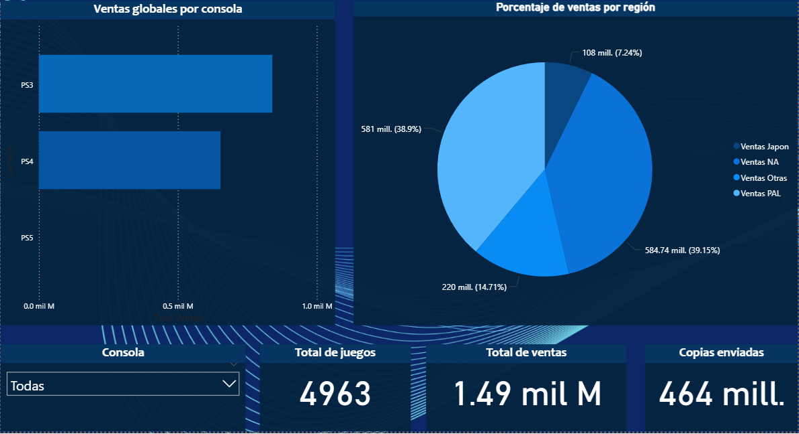
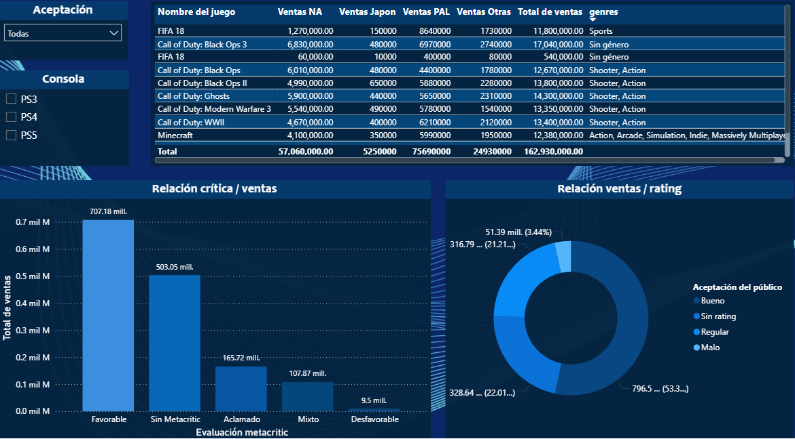
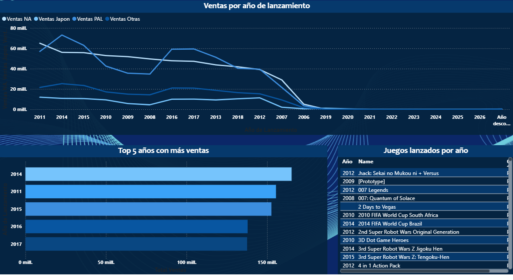
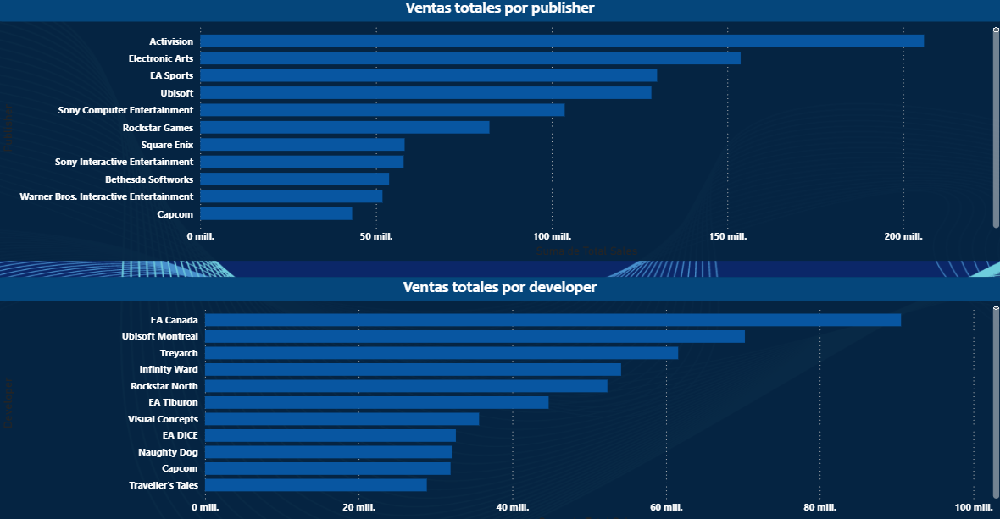

# Análisis de Ventas PlayStation (PS3, PS4, PS5)

Dashboard interactivo para analizar el rendimiento comercial de videojuegos de PlayStation.

## Ver el Dashboard en Vivo
🔗 [Haz clic aquí para ver el dashboard interactivo](https://app.powerbi.com/view?r=eyJrIjoiMDE5Nzc5MGItMTYwYS00MWUxLWE4MjMtNGUxM2FlZDhiODU4IiwidCI6IjVmMjgyOTEwLTE3NmYtNDU5ZC1hYjdkLWI3NDRhYTZlZmMwNyIsImMiOjR9)

## Objetivo del Proyecto
Construir un dashboard interactivo en Power BI que permita explorar y analizar el desempeño comercial de los videojuegos lanzados para PlayStation 3, PlayStation 4 y PlayStation 5, identificando patrones de ventas por región, consola, género y recepción crítica.

**Preguntas de negocio que responde este análisis:**

1. ¿Qué consola ha generado mayores ventas totales y promedio por juego?
2. ¿Cómo varían las preferencias de género por región (NA, PAL, Japón)?
3. ¿Existe correlación entre la puntuación de Metacritic y las ventas?
4. ¿Cómo ha evolucionado el mercado de PlayStation por año?
5. ¿Quiénes son los publishers y developers más exitosos?
6. ¿Cuáles son los juegos más vendidos?

## Fuente de Datos
- **Dataset:** PlayStation Sales and Metadata (Kaggle)
- **Registros:** 4,963 juegos
- **Variables:** 18 columnas combinando ventas (VGChartz) y metadatos (RAWG API)

## Proceso de Limpieza y Transformación
| Acción | Descripción |
|--------|-------------|
| **Eliminación** | Columna `Last Update` (43% nulos, sin valor analítico) |
| **Manejo de nulos en ventas** | Reemplazo por 0 (valores ausentes = sin ventas) |
| **Manejo de nulos en calificaciones** | Creación de categorías: "Sin Metacritic", "Favorable", "Aclamado", etc. |
| **Manejo de nulos en texto** | Reemplazo por "Género no especificado" / "Plataforma no especificada" |
| **Manejo de fechas** | Extracción de `Año Lanzamiento` con manejo de nulos |
| **Conservación de datos** | 0 filas eliminadas, 4,963 registros preservados |

## Modelo de Datos y Medidas DAX Clave
| Medida | Fórmula | Propósito |
|--------|---------|-----------|
| Total Ventas | `SUM('ps_sales_2025'[Total Sales])` | Base para todos los cálculos |
| Ventas por Región | `SUM('ps_sales_2025'[NA Sales])` | Análisis regional |
| Ventas por Categoría | `CALCULATE([Total Ventas], 'ps_sales_2025'[Categoría Metacritic] = "Aclamado")` | Impacto de la crítica |

## Dashboard: 4 Páginas

### Página 1 - Visión General

*Ventas totales, distribución por consola y por región.*

### Página 2 - Análisis por Crítica

*Correlación entre puntuaciones Metacritic y ventas.*

### Página 3 - Análisis Temporal

*Evolución de ventas por año y lanzamientos.*

### Página 4 - Publishers y Developers

*Top publishers y developers por ventas.*

## Principales Insights

1. **PS3 lidera en ventas totales** (839M) vs PS4 (653M), aunque PS4 tiene mejor promedio por juego.
2. **Datos de PS5 son preliminares** (consola lanzada en 2020). El dashboard está listo para futuras actualizaciones.
3. **La crítica importa**: Juegos con puntuaciones favorables concentran alrededor del 50% de las ventas totales, así como la aceptación de los juegos catalogados como buenos (53.34%).
4. **Shooter y Acción reinan** en todas las regiones; Aventura y Familiar son los géneros de menor desempeño.
5. **2014: año pico** en ventas; 2017: año más débil dentro del Top 5.
6. **Activision** (publisher) y **EA Canada** (developer) son los líderes del mercado.

## Tecnologías Utilizadas
- **Power BI Desktop** - Visualización y modelado
- **Power Query** - Limpieza y transformación de datos
- **DAX** - Medidas y cálculos avanzados
- **Power BI Service** - Publicación y distribución

## Recursos
- [Ver Dashboard en Vivo](https://app.powerbi.com/view?r=eyJrIjoiMDE5Nzc5MGItMTYwYS00MWUxLWE4MjMtNGUxM2FlZDhiODU4IiwidCI6IjVmMjgyOTEwLTE3NmYtNDU5ZC1hYjdkLWI3NDRhYTZlZmMwNyIsImMiOjR9)
- [Dataset Original en Kaggle](https://www.kaggle.com/datasets/gvidalguiresse/playstation-sales-and-metadata-ps3ps4ps5)

---

*Proyecto de portafolio creado por Braulio Alejandro Mercado Capulin | LinkedIn: www.linkedin.com/in/braulio-a-mercado*
